# ev-wheel-drive-optimization
Modelling and optimizing the ride of an automobile with independent electric wheel drive

## Description
This project deals with mathematical modelling of on-road vehicles. A spatial dynamic
model of a four-wheeled vehicle is introduced. The spatial model of the four-wheeled
vehicle is then used for a parametric study of the vehicle and research of the influence of
various suspension-related parameter values on driving characteristics and crew comfort.
Collected data are then used in optimizing the torque distribution and wheel turning
during a Skid Pad test (for a rear wheel drive vehicle).
The optimization of torque distribution itself is carried out by
search of the minimal value of the divergence from the prescribed route, for the demanded
movement criteria.

Key features:
- 6DOF dynamic model of an on-road vehicle
- Uses Dugoff tyre model
- Sprung and damped suspension
- Torque distribution optimization using minimisation of divergence from the prescribed route
- Parametric study of the vehicle's suspension setup
- Separate torque control function (rizeni_momentu)
- Separate steering control function (natoceni_kol)

See explanatory schemes:

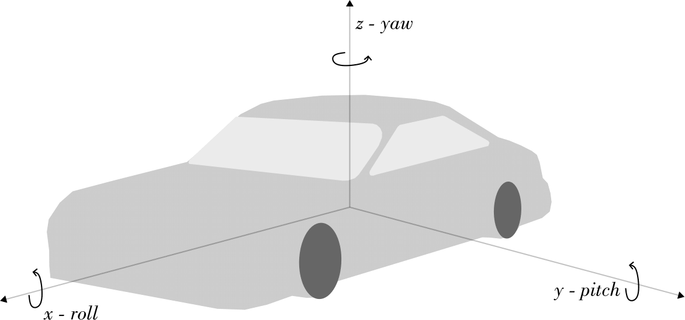
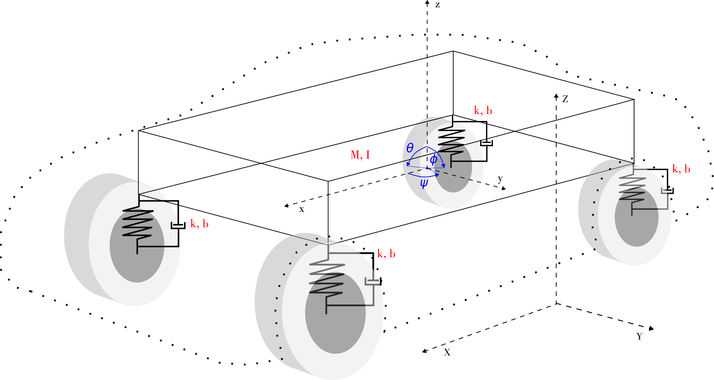
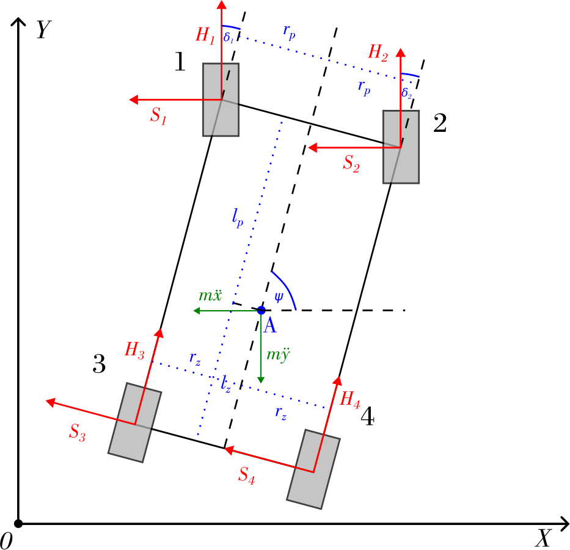
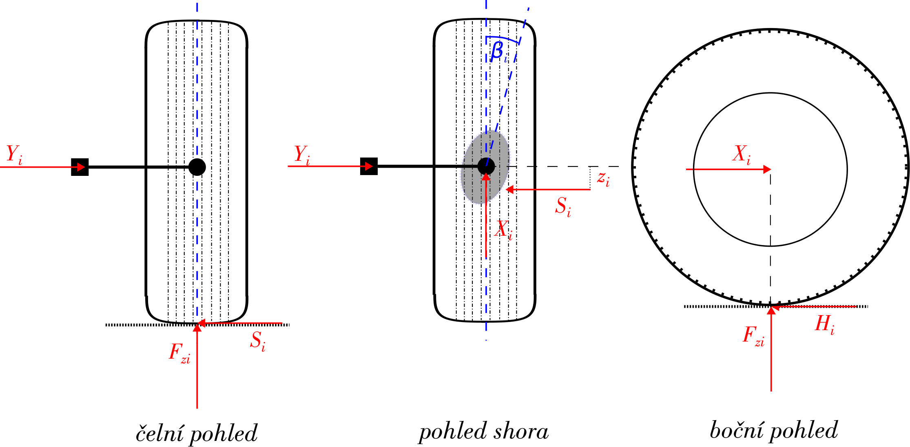

## How to Run

- The code can be found in /src
- Can be run via the Matlab interface
- The parameters can be set up in code directly

## Output
Solving an evolving system, the simulation code (model_6DOF_sim) outputs graphs of various dynamic properties unraveled over time.
One of the outputs is also a plot of the vehicles trajectory.
The optimization code (model_6DOF_opt) takes the intended radius as input, and outputs optimal steering angle, torques on each of 
the rear wheels and maximal divergence from the prescribed radius.

## Example Results

Here is an example of the output when the 3D model accelerates in a straight line.

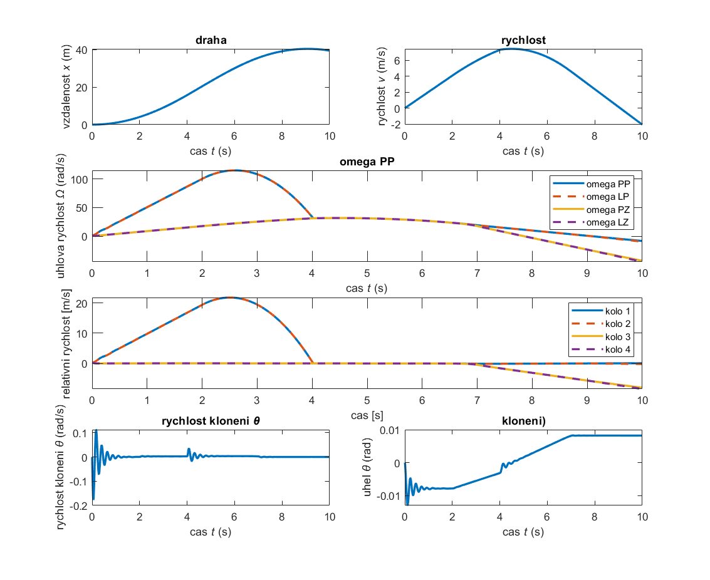

Here is an example of a comparison of dynamic results for 4 different settings:

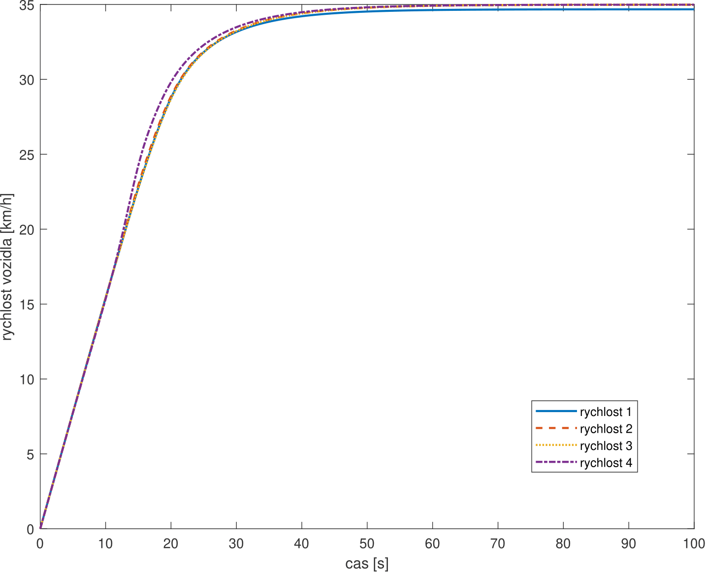
**(Speed ↑)**

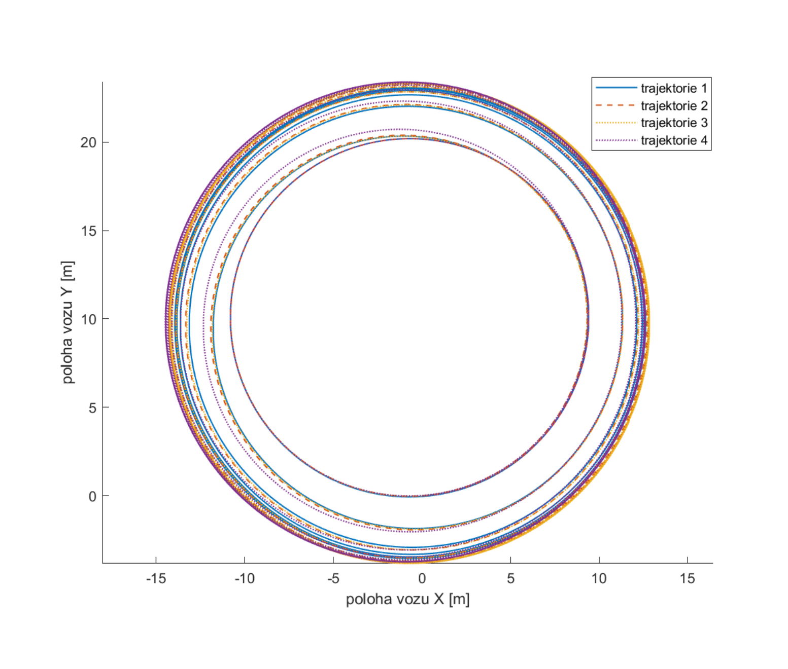
**(Trajectory of the ride ↑)**

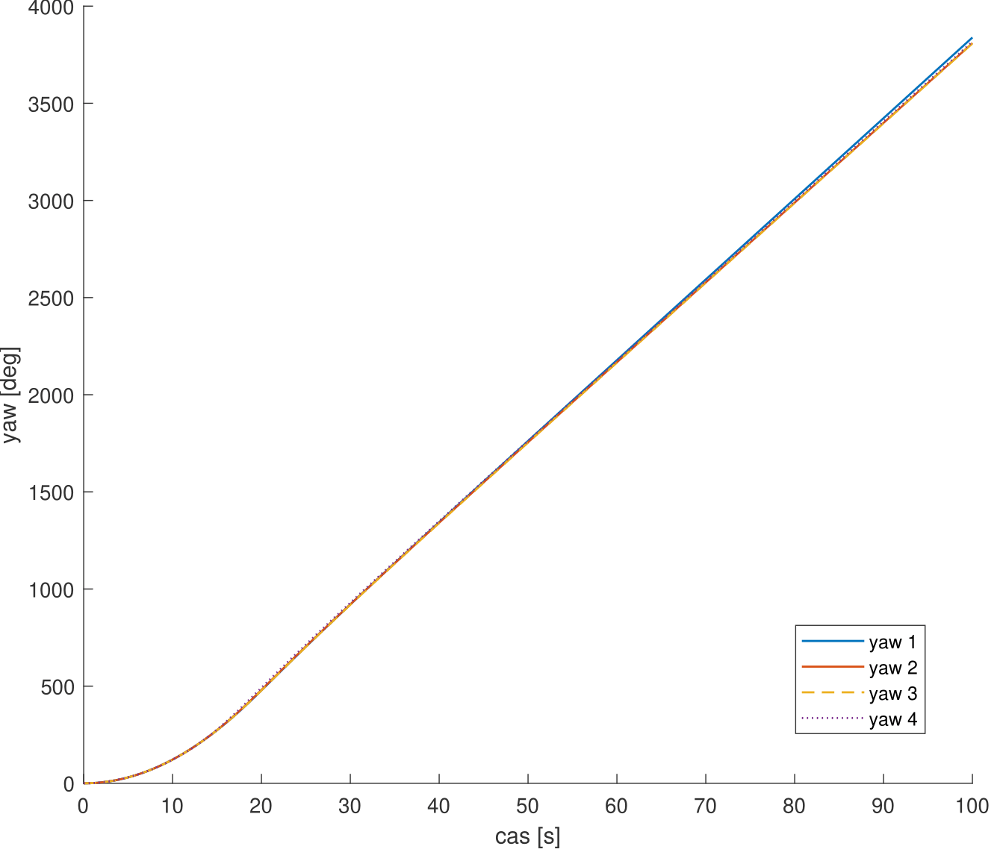

**(Yaw ↑)**

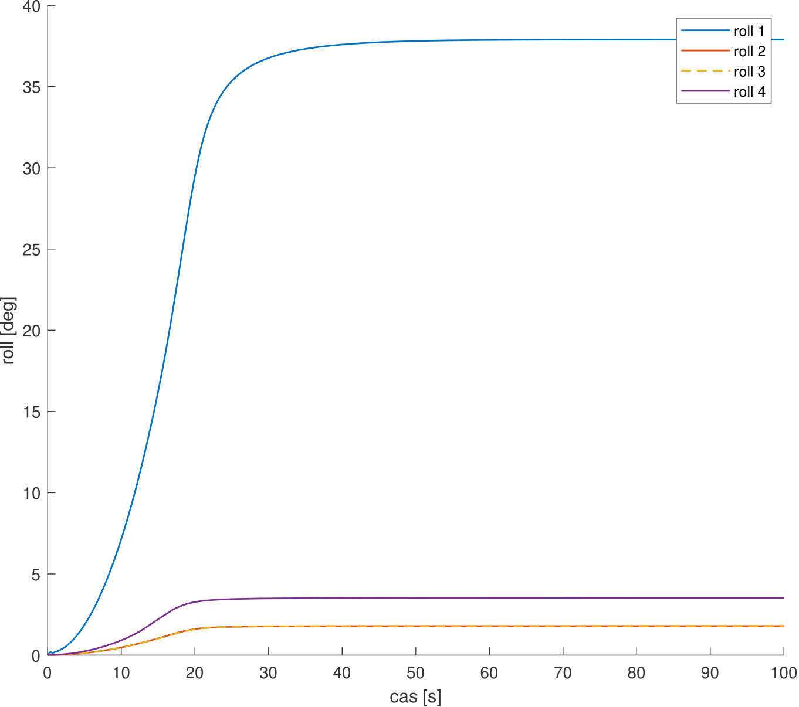
**(Roll ↑)**

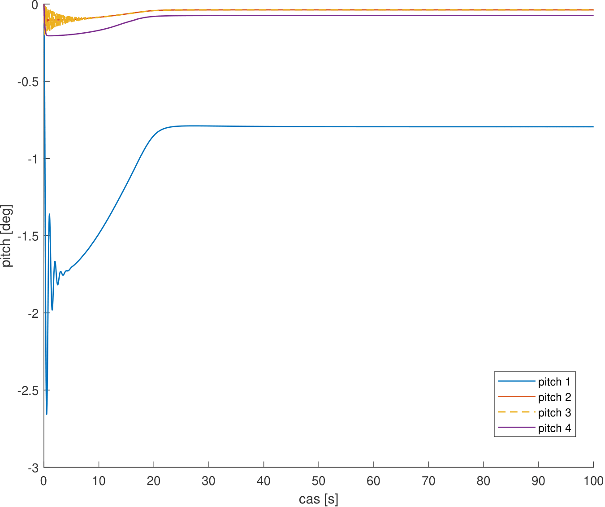
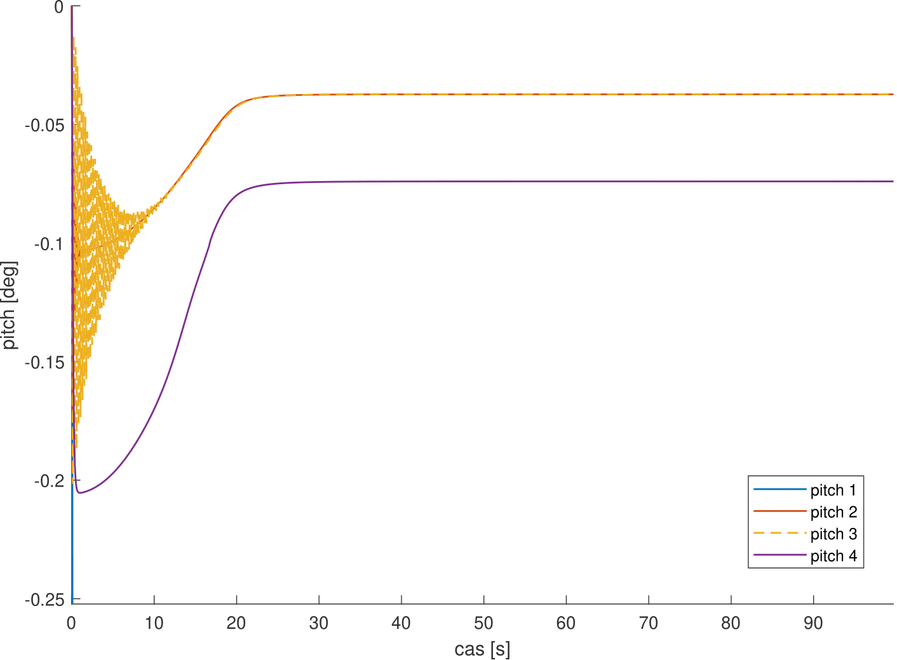
**(Pitch ↑)**

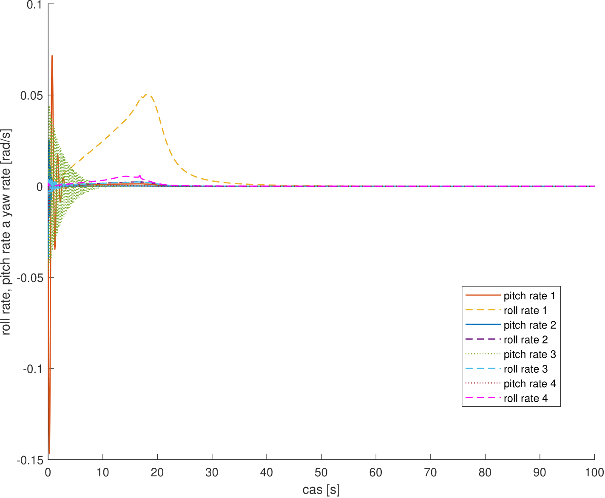
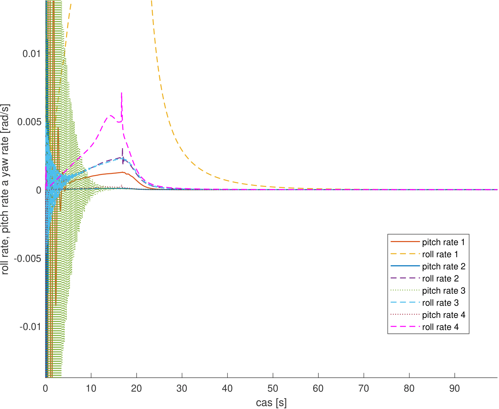
**(Rates ↑)**

